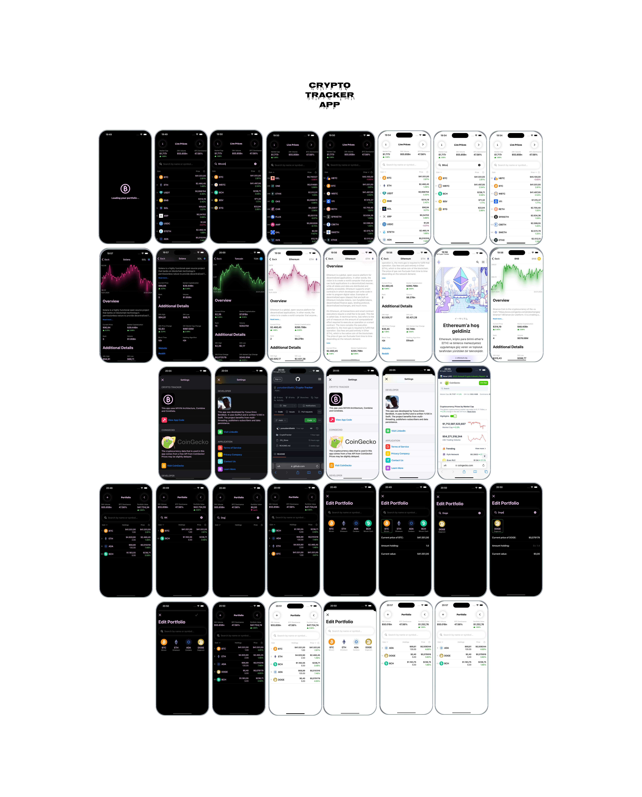

# Crypto-App

This application was developed to simplify the cryptocurrency tracking and management experience. Users can access up-to-date cryptocurrency information through the CoinGecko API and track the coins they are interested in by adding them to their wallet. Designed with SwiftUI, this app is characterized by its user-friendly interface and high performance.

## Built With
- [SwiftUI](https://developer.apple.com/xcode/swiftui/)
- [API](https://www.coingecko.com/en/api)
- [APP Trailer](https://www.youtube.com/watch?v=UlJqAgJVF5U&t=2s)

  

## Overview
* Uses SwiftUI
* Uses Combine, CoreData
* Designed with MVVM pattern
* No External Dependencies
* Universal App: Run on iPhone, iPad, and Mac
* Leverages free CoinGecko API.

## Design
The app has five key area that we will build out step-by-step
1. Home
2. Settings
3. Portfolio
